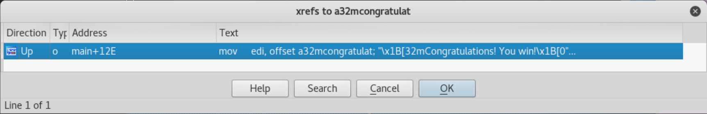

# Binary Workshop (Part 2)
In this workshop, we're going to explore a number of useful tools for reverse engineering more complex binaries.

# GDB
So far, we've only used *static* analysis techniques to reverse engineer
binaries. These techniques allow us to learn about the binary without having to
run it. To perform *dynamic* analysis, we will need to use a debugger, which
will allow us to step through individual instructions, examine memory, and
alter program execution while the program runs.

For this guide we'll use GDB, the Gnu Debugger. This basic yet powerful
debugger can be found on virtually any system, which makes it a good tool to be
familiar with.

## zeller
Run the zeller program to find what day of the week you were born on (or any
other significant event occurred). Just from running zeller, you can get an
idea of what it does, but not the way it does it. You could easily find the
formula online, but don't do that (yet)! Instead, we'll try to recover the
formula from the binary.

## `disassemble`
Run `gdb zeller` to open zeller from within GDB. You'll get a rather long
welcome message (which can be suppressed with the `-q` flag) and a `(gdb)`
prompt. At this point the `zeller` program has been loaded into memory, but no
commands have been run. You can view the disassembly of zeller's `main()`
function by running `disassemble main` at the gdb prompt. To view it in Intel
syntax rather than AT&T syntax, you must first run `set disassembly-flavor
intel`. Your output will look something like this:

```
(gdb) set disassembly-flavor intel
(gdb) disassemble main
Dump of assembler code for function main:
   0x000000000040080a <+0>:     push   rbp
   0x000000000040080b <+1>:     mov    rbp,rsp
   0x000000000040080e <+4>:     push   rbx
   0x000000000040080f <+5>:     sub    rsp,0x18
   0x0000000000400813 <+9>:     mov    edi,0x400a38
   0x0000000000400818 <+14>:    call   0x400590 <puts@plt>
   0x000000000040081d <+19>:    mov    edi,0x400a60
   0x0000000000400822 <+24>:    call   0x400590 <puts@plt>
   0x0000000000400827 <+29>:    mov    edi,0x400a38
   0x000000000040082c <+34>:    call   0x400590 <puts@plt>
   ...
End of assembler dump.
(gdb)
```

From the disassembly above, we can tell that there are several calls to
`puts()` before any input is even read. We can infer that this is the welcome
banner at the beginning of the program.

## `break`
To actually run the program we first have to set a breakpoint. The syntax is
either `break <function>` or `break *<address>`. Since we want to analyze the
execution of the `main()` function, run `break main`. You can view information
about breakpoints with `info breakpoints`. You can then start the program from
the beginning with the `run` command. If you've already hit a breakpoint, you
can continue to the next breakpoint with the `continue` command.

```
(gdb) break main
Breakpoint 1 at 0x40080e
(gdb) info breakpoints
Num     Type           Disp Enb Address            What
1       breakpoint     keep y   0x000000000040080e <main+4>
(gdb) run
Starting program: /home/devneal/techsec/meeting_notes/03-13-17_binaries_part2/zeller

Breakpoint 1, 0x000000000040080e in main ()
(gdb)
```
## `x` and `display`
The program has just stopped at the start of the `main()` function in `zeller`.
However, there isn't much to indicate it. You can view the contents of the
registers by running `info registers`.

```
(gdb) info registers
rax            0x40080a 4196362
rbx            0x0      0
rcx            0x0      0
rdx            0x7fffffffde88   140737488346760
rsi            0x7fffffffde78   140737488346744
rdi            0x1      1
rbp            0x7fffffffdd90   0x7fffffffdd90
rsp            0x7fffffffdd90   0x7fffffffdd90
r8             0x4009e0 4196832
r9             0x7ffff7de78e0   140737351940320
r10            0x846    2118
r11            0x7ffff7a2e740   140737348036416
r12            0x400610 4195856
r13            0x7fffffffde70   140737488346736
r14            0x0      0
r15            0x0      0
rip            0x40080e 0x40080e <main+4>
eflags         0x246    [ PF ZF IF ]
cs             0x33     51
ss             0x2b     43
ds             0x0      0
es             0x0      0
fs             0x0      0
gs             0x0      0
(gdb)
```

The output shows that `rip` contains the value `0x40080e`. We can view the next
few instructions located at `0x40080e` with the `x` (examine) command. The
syntax for the `x` command is `x/<number><format><size> <address>`. `<number>`
is the number of elements of data you want to view, `<format>` is the way you
want to read them, and `<size>` is the size of one element. `<format>` may be
any of the following:
* `x` - hexadecimal
* `d` - signed decimal
* `u` - unsigned decimal
* `c` - char
* `s` - string
* `t` - binary (two)
* `o` - octal

Similarly, `<size>` may be any of:
* `b` - byte
* `w` - word (4 bytes)
* `g` - giant (8 bytes)

We can also use the syntax `x/<number>i address` to read the memory as assembly
instructions:

```
gdb) x/10i 0x40080e
=> 0x40080e <main+4>:   push   rbx
   0x40080f <main+5>:   sub    rsp,0x18
   0x400813 <main+9>:   mov    edi,0x400a38
   0x400818 <main+14>:  call   0x400590 <puts@plt>
   0x40081d <main+19>:  mov    edi,0x400a60
   0x400822 <main+24>:  call   0x400590 <puts@plt>
   0x400827 <main+29>:  mov    edi,0x400a38
   0x40082c <main+34>:  call   0x400590 <puts@plt>
   0x400831 <main+39>:  mov    edi,0xa
   0x400836 <main+44>:  call   0x400580 <putchar@plt>
(gdb)
```

You could also run `x/10i $rip` to achieve the same result. It would be helpful
to display the next few instructions as we step through the program. This can
be achieved with `display/10i $rip`. In fact, we can continually view any
location in memory with the syntax `display/<number><format> <address>`.

## `nexti` and `stepi`
Now we're ready to begin stepping through the program. The `nexti` instruction
will execute a single assembly instruction, unless that instruction is a
function call, in which case it will step over the call. `stepi` works
similarly, but will step into function calls. Run `nexti` a few times and see
how the output instructions change. You'll also see the `zeller` welcome banner
being printed.

## Reading the name and date

Stop just before one of the calls to `printf()`, as seen below. If you already
passed them, you can start the program over with `run`.

```
(gdb)
0x0000000000400822 in main ()
3: x/10i $rip
=> 0x400822 <main+24>:  call   0x400590 <puts@plt>
   0x400827 <main+29>:  mov    edi,0x400a38
   0x40082c <main+34>:  call   0x400590 <puts@plt>
   0x400831 <main+39>:  mov    edi,0xa
   0x400836 <main+44>:  call   0x400580 <putchar@plt>
   0x40083b <main+49>:  mov    edi,0x400a87
   0x400840 <main+54>:  mov    eax,0x0
   0x400845 <main+59>:  call   0x4005b0 <printf@plt>
   0x40084a <main+64>:  mov    esi,0x601160
   0x40084f <main+69>:  mov    edi,0x400a96
(gdb)
```

According to the AMD64 calling convention, the first argument to `puts()`
should be contained in `rdi`. To verify this, run `info register rdi`.

```
(gdb) info register rdi
rdi            0x400a60 4196960
(gdb)
```
`rdi` appears to be a pointer, as expected. Let's see what it points at:

```
(gdb) x/s 0x400a60
0x400a60:       "==== Zeller's Equation Calculator ===="
(gdb)
```

You can also run `x/s $rdi`, or `x/20c 0x400a60`, etc.

Stop just before a call to `scanf()`, either by setting a breakpoint or
stepping through. You can run `man scanf` from the bash shell to see how
`scanf()` is used. It takes a format string, then a number of addresses to
write data. Let's examine this on our own:

```
Breakpoint 2, 0x0000000000400859 in main ()
3: x/10i $rip
=> 0x400859 <main+79>:  call   0x4005f0 <__isoc99_scanf@plt>
   0x40085e <main+84>:  mov    esi,0x601160
   0x400863 <main+89>:  mov    edi,0x400aa0
   0x400868 <main+94>:  mov    eax,0x0
   0x40086d <main+99>:  call   0x4005b0 <printf@plt>
   0x400872 <main+104>: mov    esi,0x6011a0
   0x400877 <main+109>: mov    edi,0x400a96
   0x40087c <main+114>: mov    eax,0x0
   0x400881 <main+119>: call   0x4005f0 <__isoc99_scanf@plt>
   0x400886 <main+124>: mov    edx,0x601120
(gdb) i r rdi
rdi            0x400a96 4197014
(gdb) i r rsi
rsi            0x601160 6295904
(gdb) x/s 0x400a96
0x400a96:       "%49s"
(gdb) x/s 0x601160
0x601160 <name>:        ""
(gdb) ni
Enter a name: Devin
0x000000000040085e in main ()
3: x/10i $rip
=> 0x40085e <main+84>:  mov    esi,0x601160
   0x400863 <main+89>:  mov    edi,0x400aa0
   0x400868 <main+94>:  mov    eax,0x0
   0x40086d <main+99>:  call   0x4005b0 <printf@plt>
   0x400872 <main+104>: mov    esi,0x6011a0
   0x400877 <main+109>: mov    edi,0x400a96
   0x40087c <main+114>: mov    eax,0x0
   0x400881 <main+119>: call   0x4005f0 <__isoc99_scanf@plt>
   0x400886 <main+124>: mov    edx,0x601120
   0x40088b <main+129>: mov    esi,0x400ac3
(gdb) x/s 0x601160
0x601160 <name>:        "Devin"
(gdb)
```

Before the call to `scanf()`, `esi` is pointing at an empty string. After the
call, my input was written to `0x601160`. This address holds the name I just
entered.

Now, let's take a look at the next few instructions:

```
=> 0x40085e <main+84>:  mov    esi,0x601160
   0x400863 <main+89>:  mov    edi,0x400aa0
   0x400868 <main+94>:  mov    eax,0x0
   0x40086d <main+99>:  call   0x4005b0 <printf@plt>
```

We can actually analyze this statically and verify it dynamically. The address
containing the string I entered is being moved into `esi`, so it must be the
second argument to `printf()`. That means the following call to `printf()`
contains a format string which will print my name. Verify this by reading the
string at `0x400aa0`, then continue until the next call to `scanf()`. You can
run the same commands as above to see that it's writing to `0x6011a0`, a
different location than the name. This means that the two strings are stored as
different variables.

## Parsing the date
Next we see a call to `sscanf()`:

```
0x0000000000400885 in main ()
1: x/10i $rip
=> 0x400885 <main+123>: mov    edx,0x601120
   0x40088a <main+128>: mov    esi,0x400ac3
   0x40088f <main+133>: mov    edi,0x6011a0
   0x400894 <main+138>: mov    eax,0x0
   0x400899 <main+143>: call   0x4005d0 <__isoc99_sscanf@plt>
   0x40089e <main+148>: mov    edi,0x601120
   0x4008a3 <main+153>: call   0x4005a0 <strlen@plt>
   0x4008a8 <main+158>: mov    DWORD PTR [rbp-0x14],eax
   0x4008ab <main+161>: mov    eax,DWORD PTR [rbp-0x14]
   0x4008ae <main+164>: cdqe
(gdb) x/s 0x6011a0
0x6011a0 <date_str>:    "05/06/1995"
(gdb) x/s 0x400ac3
0x400ac3:       "%[^/]s"
(gdb)
```

Nothing too fancy. It's simply scanning the string I gave it ("05/06/1995") up
to the first occurrence of the "/" character. This means that `0x601120`
contains the string "05". It then stores the length of the string in `DWORD PTR
[rbp-0x14]`. Let's see what's next:

```
0x00000000004008ab in main ()
1: x/10i $rip
=> 0x4008ab <main+161>: mov    eax,DWORD PTR [rbp-0x14]
   0x4008ae <main+164>: cdqe
   0x4008b0 <main+166>: add    rax,0x1
   0x4008b4 <main+170>: add    rax,0x6011a0
   0x4008ba <main+176>: mov    edx,0x6010e0
   0x4008bf <main+181>: mov    esi,0x400ac3
   0x4008c4 <main+186>: mov    rdi,rax
   0x4008c7 <main+189>: mov    eax,0x0
   0x4008cc <main+194>: call   0x4005d0 <__isoc99_sscanf@plt>
   0x4008d1 <main+199>: mov    edi,0x6010e0
(gdb)
```

`cdqe`? A strange-looking instruction for sure, but it turns out not to be so
bad. A quick google search will tell exactly what it does. From there we add `1
+ 0x6011a0` to `rax`. So the first argument to the next `sscanf()` is
`strlen(month_str) + 1 + date_str`. The second must be "%[^/]" since it is the
same string from the last call, and the last is a memory address. If we view
the fist argument, the logic becomes clear:

```
0x00000000004008cc in main ()
1: x/10i $rip
=> 0x4008cc <main+194>: call   0x4005d0 <__isoc99_sscanf@plt>
   0x4008d1 <main+199>: mov    edi,0x6010e0
   0x4008d6 <main+204>: call   0x4005a0 <strlen@plt>
   0x4008db <main+209>: mov    DWORD PTR [rbp-0x10],eax
   0x4008de <main+212>: mov    eax,DWORD PTR [rbp-0x14]
   0x4008e1 <main+215>: movsxd rdx,eax
   0x4008e4 <main+218>: mov    eax,DWORD PTR [rbp-0x10]
   0x4008e7 <main+221>: cdqe
   0x4008e9 <main+223>: add    rax,rdx
   0x4008ec <main+226>: add    rax,0x2
(gdb) x/s $rdi
0x6011a3 <date_str+3>:  "06/1995"
(gdb)
```

By adding the length of the first string read ("05") plus one to the original
date string, the program has moved the pointer up to the next number to be
read. From here, the program will again read until encountering a "/"
character. Step through and try to understand the third call to `sscanf()` on
your own.

After the third call to `sscanf()`, there are a number of calls to `atoi()`.
It's pretty easy to determine their purpose just by reading their inputs (and
possibly checking `man atoi`).

```
Breakpoint 2, 0x0000000000400911 in main ()
1: x/10i $rip
=> 0x400911 <main+259>: mov    edi,0x601120
   0x400916 <main+264>: call   0x4005e0 <atoi@plt>
   0x40091b <main+269>: mov    DWORD PTR [rbp-0xc],eax
   0x40091e <main+272>: mov    edi,0x6010e0
   0x400923 <main+277>: call   0x4005e0 <atoi@plt>
   0x400928 <main+282>: mov    DWORD PTR [rbp-0x8],eax
   0x40092b <main+285>: mov    edi,0x6011e0
   0x400930 <main+290>: call   0x4005e0 <atoi@plt>
   0x400935 <main+295>: mov    DWORD PTR [rbp-0x4],eax
   0x400938 <main+298>: mov    edx,DWORD PTR [rbp-0x4]
(gdb) x/s 0x601120
0x601120 <month_str>:   "05"
(gdb) x/s 0x6010e0
0x6010e0 <day_str>:     "06"
(gdb) x/s 0x6011e0
0x6011e0 <year_str>:    "1995"
(gdb)
```
The numerical values of the dates are being calculated and stored in `DWORD PTR
[rbp-0xc]`, `DWORD PTR [rbp-0x8]`, and `DWORD PTR [rbp-0x4]`. The plot thickens!

## `zeller()`
Finally, the arguments are passed to a function called `zeller()`. Whatever
`zeller()` does, the program then uses its return value as an argument to
`printf()`, so it's probably a `char*`. A little more analysis (stepping a bit
more and viewing the inputs to `printf()`) reveals that it returns a `char*`
corresponding to the day of the week on which the date occurred. All that
remains is to find what `zeller()` actually does.

There are two ways you can continue from here. You *could* do this on your own,
by setting a breakpoint at `zeller()`, stepping through, and taking notes. Or
you could view the formula
[here](https://en.wikipedia.org/wiki/Zeller%27s_congruence) and walk through
the code and see how it translates to assembly. Or a combination of both, if
that's what you prefer.

<<<<<<< HEAD
# `PEDA`
`peda` is an extension to `GDB` that makes it a bit nicer to use. You can
download it with `git clone https://github.com/longld/peda`. You can then start
`peda` by running `gdb`, then running `source ~/peda/peda.py` from the `gdb`
prompt.

```
[----------------------------------registers-----------------------------------]
RAX: 0x40080e (<main>:  push   rbp)
RBX: 0x0
RCX: 0x0
RDX: 0x7fffffffde88 --> 0x7fffffffe227 ("XDG_VTNR=7")
RSI: 0x7fffffffde78 --> 0x7fffffffe1e4 ("/home/devneal/techsec/meeting_notes/03-13-17_binaries_part2/zeller")
RDI: 0x1
RBP: 0x7fffffffdd90 --> 0x400970 (<__libc_csu_init>:    push   r15)
RSP: 0x7fffffffdd90 --> 0x400970 (<__libc_csu_init>:    push   r15)
RIP: 0x400812 (<main+4>:        sub    rsp,0x20)
R8 : 0x4009e0 (<__libc_csu_fini>:       repz ret)
R9 : 0x7ffff7de78e0 (<_dl_fini>:        push   rbp)
R10: 0x846
R11: 0x7ffff7a2e740 (<__libc_start_main>:       push   r14)
R12: 0x400610 (<_start>:        xor    ebp,ebp)
R13: 0x7fffffffde70 --> 0x1
R14: 0x0
R15: 0x0
EFLAGS: 0x246 (carry PARITY adjust ZERO sign trap INTERRUPT direction overflow)
[-------------------------------------code-------------------------------------]
   0x40080d <zeller+204>:       ret
   0x40080e <main>:     push   rbp
   0x40080f <main+1>:   mov    rbp,rsp
=> 0x400812 <main+4>:   sub    rsp,0x20
   0x400816 <main+8>:   mov    edi,0x400a38
   0x40081b <main+13>:  call   0x400590 <puts@plt>
   0x400820 <main+18>:  mov    edi,0x400a60
   0x400825 <main+23>:  call   0x400590 <puts@plt>
[------------------------------------stack-------------------------------------]
0000| 0x7fffffffdd90 --> 0x400970 (<__libc_csu_init>:   push   r15)
0008| 0x7fffffffdd98 --> 0x7ffff7a2e830 (<__libc_start_main+240>:       mov    edi,eax)
0016| 0x7fffffffdda0 --> 0x0
0024| 0x7fffffffdda8 --> 0x7fffffffde78 --> 0x7fffffffe1e4 ("/home/devneal/techsec/meeting_notes/03-13-17_binaries_part2/zeller")
0032| 0x7fffffffddb0 --> 0x100000000
0040| 0x7fffffffddb8 --> 0x40080e (<main>:      push   rbp)
0048| 0x7fffffffddc0 --> 0x0
0056| 0x7fffffffddc8 --> 0xc45de35a33218fe0
[------------------------------------------------------------------------------]
Legend: code, data, rodata, value

Breakpoint 1, 0x0000000000400812 in main ()
gdb-peda$
```

You'll notice that when you hit a breakpoint in `peda`, your given a breakdown
of the stack, registers, and next few instructions to be executed. This
alleviates some of the burden of constantly running `disp/10i $rip` or
`disp/12xg $rsp`. You can view these "contexts" at any time by running `context
reg`, `context code`, and `context stack`. You also have a shiny new way to
disassemble functions: `pdisas <function>` will give you an annotated view of
`<function>`'s assembly code

# pwntools
pwntools is the de-facto library for CTF challenges. It includes a raft of utilities for communicating with processes, writing exploits, and dealing with various encodings. 

Today we're just going to one part of the pwntools library dealing with interacting with the binary you're reversing. Specifically we're interested in the `pwnlib.tubes` module.

Before we get into the details, we need to install pwntools. Simply follow the instructions listed [here](http://docs.pwntools.com/en/stable/install.html). Let us know if you have any difficulties.

Before pwntools, the only way to interact with remote challenges or local binaries was to use python's socket and subprocess modules respectively. These modules are super difficult to use reliably and the source of much frustration. You would often find that you spent more getting the communication to work than solving the damn challenge.

pwntools' docs are pretty good, so you should just read what it has to say [about its tubes module](http://docs.pwntools.com/en/stable/intro.html#making-connections).

Basically, interacting with a local binary (named `foo.bin` for this example) is as simple as:

```python
from pwn import *

foo = process('foo.bin')
foo.sendline('hello')
x = foo.recvline()
if x == 'goodbye':
    foo.close()
else:
    foo.interactive()
```

The only 3 functions that are really important to remember are `recvline`, `sendline` and `interactive`, and happily these are all pretty self-explanatory and work exactly as you'd expect them to.

In this directory, we've included a copy of the `challenge3` binary from the last workshop, but modified to make it infeasible to complete manually. (If you haven't yet reverse engineered the binary yet, talk to us and we can explain the solution). Your task is to use pwntools to solve this new challenge. (Again, your goal is to get it to print the congratulatory message). The binary is called `automate_me`.

Finally, frequently CTF challenges (particularly in the pwn category) will ask you to interact with a running process on a remote server. Instead of printing out a congratulatory message, it might read the flag from a file on the server and print it out.

In pwntools, this is as simple as changing `process('foo.bin')` to `remote('foo.challenge.ctf', 1337)`; all the `recvline`'s and `sendline`s should continue to function.

<<<<<<< HEAD
# IDA
=======
## IDA
For both of the two challenges in this workshop, you can also use IDA to statically analyze the binaries. IDA also has a powerful debugging interface, but unfortunately, IDA does not have a 64-bit Linux debugger.

Try looking at `automate_me` in IDA. At the load dialog select the default options for now.


You can list entry points to jump to with `Ctrl+e`. Go to the main function and view the code graph. vYou can switch between code graph view and assembly view by pressing `Space`.


Double-clicking a location or function name will transport you there. To return to a previous view, press `Esc`. Try going to the `generate` and `verify` functions and returning to `main`.

As you reverse, you'll want to add comments and rename functions/variables so you can better understand what's going on. Press `n` while highlighting a variable/function, and a dialog will open that will allow you to rename it. Press `:` to enter a comment on the currently highlighted line.


One of IDA's most powerful tools is its ability to cross-reference functions and data. For example, you can get a view of all the strings in the binary with the shortcut `Shift+F12`, or you can go to `View->Open Subviews->Strings` in the top toolbar. You can then click on a string to take you to the place it's stored in the data section, and type `x` to get a list of cross-references to the string. Find out where the `Congratulations` string is printed. 




Other useful tips:

* To show opcodes in assembly view, go to `Options->General->Disassembly` and set `Number of opcode bytes` to 8.

* IDA has NO UNDO BUTTON! Make backups so that you can go back if you screw something up.

* You can pack and save an IDA database, and distribute this so that others have access to your defined function names, comments, etc.

* IDA has an interactive Python shell at the bottom of the Output window.

* You can change bytes in the IDA program with `Edit->Patch Program->Change Byte`. Then apply the patches to the input file with `Edit->Patch Program->Apply Patches to Input File`.

# Resources

This was a lot of information. Feel free to go through this entire guide at your own pace, and email us with any questions. If you want an alternate take or extra information on these topics check out these links:

* [RMS's gdb Tutorial](http://www.unknownroad.com/rtfm/gdbtut/gdbtoc.html) - tutorial on gdb from the creator himself
* [pwntools documentation](https://docs.pwntools.com/en/stable/) - the "getting started" section is particularly informative
* [The IDA Pro Book](https://www.nostarch.com/idapro2.htm) - "the unofficial guide to the world's most popular disassembler". You can read this as an e-book online if you're an MIT affiliate at this [link](https://search.ebscohost.com/login.aspx?direct=true&db=cat00916a&AN=mit.002013005&site=eds-live&scope=site&custid=s8978330&authtype=sso) (click "Get this @ MIT").
* [Unofficial Guide to PEDA](http://security.cs.pub.ro/hexcellents/wiki/kb/toolset/peda) - A good reference for starting with PEDA
