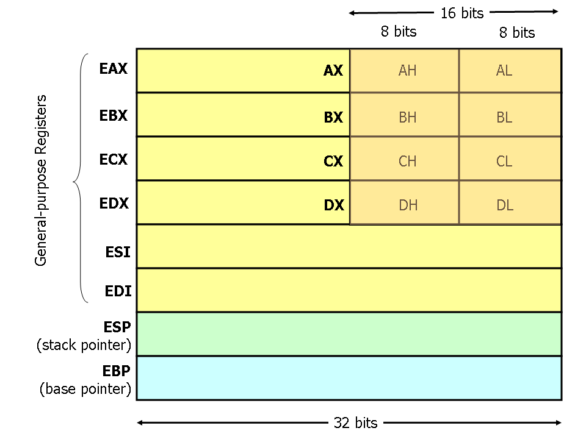
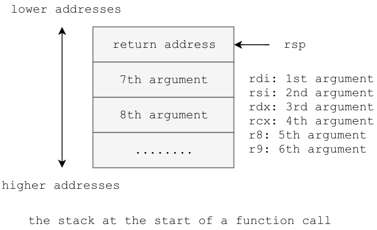

# Binary Workshop
The first step in learning to exploit programs is understanding how they work.
This guide is going to cover ELF executables specifically, but the knowledge is
generally applicable to other types of executables. We colloquially refer to
compiled programs as *binaries*. Binaries are composed of machine code, an
extremely rudimentary set of instructions that are specific to the CPU.

## Architecture
In order to understand binaries, it's helpful to have a working model of a
computer in mind. The most important components to know are the memory, the
CPU, and registers, and memory.


## Memory
*Memory* is a location where data can either be written to or read from. When a
binary is executed, memory is organized into segments as pictured above.

* The `.text` segment contains the binary's machine code.
* The `.data` segment contains global and static variables which are
initialized in the program source.
* The `.bss` segment contains global and static variables which are
uninitialized in the program source.
* The `heap` segment is used for memory which is dynamically allocated during
runtime. It is manipulated with the `malloc()` and `free()` functions and grows
toward higher addresses.
* The `stack` segment is used to store local variables and organize function
calls. The stack consists of *stack frames*, which are allocated each time a
function is called and deallocated each time a function returns. The stack
grows toward lower addresses.

## The CPU and Registers
The *CPU* reads machine and executes machine code. This usually means reading
from and writing to memory and performing arithmetic operations on data.

*Registers* are locations on the CPU where data can be stored and manipulated.
Registers can generally be used in any way, but by convention they each have
specific uses. We will detail a few of those uses here, and introduce more as
we encounter them.

* `rax` (accumulator) is used to store function return values.
* `rsp` (stack pointer) points to the "top" (lowest address) of the current
stack frame.
* `rbp` (base pointer / frame pointer) points to the "base" (highest address)
of the current
stack frame.
* `rdi` (destination index) is used to store the first argument in a function
call.
* `rip` (instruction pointer) points to the next instruction to be executed.

The size of a register depends on the type of CPU. A 32-bit CPU will have
32-bit registers, just as a 64-bit CPU will have 64-bit registers. In large
registers, some parts of the register can be manipulated independently of the
others. For example, `rax` is a 64 bit register. The lower 32 bits of `rax` are
referred to as `eax`. The lower 16 bits are called `ax`, and the lower 8 bits
are called `al`. The second lowest 8 bits are called `ah`.




# `hello.c`
First we'll write a simple program and look at it's machine code. Write the
program below (or a similar one), compile it, and run it if you want:

```C
#include <stdio.h>

int main(void) {
    printf("Welcome to TechSec\n");
    return 0;
}
```

To compile the source code into a binary, run `gcc -o hello hello.c`. You can
also run the program with `./hello` if desired.

We'll view the binary's machine code with `objdump`. Run `objdump -M intel -d
hello | less` and your screen will fill with machine code.* From here, you can
scroll line by line with `j` and `k`, or scroll page by page with the spacebar
and `b`. You can search for text with `/$text`, jump to the next occurrence
with `n`, and jump to the previous occurrence with `N`. Search for `<main>` to
see the machine code for `main()`.  It will look something like this:

```
0000000000400526 <main>:
  400526:       55                      push   rbp
  400527:       48 89 e5                mov    rbp,rsp
  40052a:       bf c4 05 40 00          mov    edi,0x4005c4
  40052f:       e8 cc fe ff ff          call   400400 <puts@plt>
  400534:       b8 00 00 00 00          mov    eax,0x0
  400539:       5d                      pop    rbp
  40053a:       c3                      ret
  40053b:       0f 1f 44 00 00          nop    DWORD PTR [rax+rax*1+0x0]
```

* If you're using a mac, you'll have to use `-x86-asm-syntax intel` rather than
`-M intel`

The line at the top is the name of the current symbol (`main`) and it's
location in memory. A *symbol* is a location in memory that the compiler
decided to name. Functions and global variables in C code become symbols in
machine code.The following lines are the location of a machine code
instruction, the bytes representing that instruction, and the "human readable"
assembly code corresponding to that instruction.

## Intel vs. AT&T
The assembly pictured above is written in Intel syntax. If you chanced to run
`objdump` without the `-M intel` flag, you would have seen assembly written in
AT&T syntax. AT&T syntax is easy to recognize due to the cacophony of `$` and
`%` characters prefixing everything. People tend to find Intel syntax easier to
read, so for the purposes of this guide, we will use it.  If you ever find
yourself in a situation where you have to read assembly written in AT&T syntax,
just remember that location of the source and destination arguments are
swapped.

## Some basic x86 assembly
Assembly instructions in Intel syntax have the form `<instruction>
<destination> <source>`, or just `<instruction> <argument>` if there is no
destination and source. The disassembly of `main()` in `hello.c` contains the
following instructions:

* `mov` - write data specified by `source` to `destination`.
* `push` - decrement the stack pointer, then write data specified by `argument`
  to the top of the stack.
* `pop` - write data at the top of the stack to `argument`, then increment the
  stack pointer.
* `call` - `push` the location of the next instruction, then move the location
  specified by `argument` into `rip`.
* `ret` - move the location at the top of the stack into `rip`, then increment
  the stack pointer.
* `nop` - do absolutely nothing.

When an assembly instruction references memory, it must specify both the
location and size of that memory. The syntax for addressing memory is `SIZE PTR
[addr]`, where `SIZE` is one of the following:

* `BYTE` - 1 byte
* `WORD` - 2 bytes
* `DWORD` - 4 bytes
* `QWORD` - 8 bytes

# Calling Convention
Before you can fully understand the assembly in `hello`, you'll need to know
how function calls are made in 64-bit UNIX programs. The calling convention has
two parts, instructions for the caller and instructions for the callee.

## Caller
The caller's first responsibility is to load function arguments into registers,
and onto the stack if necessary. Integer and pointer arguments are loaded into
`rdi`, `rsi`, `rdx`, `rcx`, `r8`, and `r9` in that order. Float and double
arguments are loaded into `xmm0` through `xmm7` in order. If there are more
than six arguments, the rest are pushed onto the stack in reverse order. The
caller then executes the call instruction, which pushes the location of the
next instruction onto the stack. This location is called the *return address*.
(TODO: swap `rcx` and `rdx` on the diagram below)



The caller is also responsible for cleaning up the stack after the callee
returns. This means adding to the `rsp` after executing the call instruction.

## Callee
It's the callee's responsibility to start a new stack frame, and clean it up
at the end of execution. It must also leave its return value in `rax`, and
restore `rbx` and `r12`-`r15` if it changes them. The callee restores the
registers by `push`ing them onto the stack at the start of the function (after
the function prologue), then `pop`ing them off before returning (before the
function epilogue).

The callee builds a stack frame by executing a function prologue:
```
   push rbp
   mov rbp, rsp
   sub esp, N
```
and cleans it up by executing a function epilogue:
```
   mov rsp, rbp
   pop rbp
   ret
```


After the function prologue has been executed, the callee references local
variables with a negative offset from `rbp` and arguments seven and later with
a positive offset from `rbp`. You can see this calling convention executed in
machine code by compiling `args.c` and reading it's disassembly.

# Reading assembly
With this new information, we can now understand what `hello` is doing at the
assembly level.

```
# Creating a stack frame for main()
push   rbp
mov    rbp,rsp

# Making a call to puts(0x4005c4)
mov    edi,0x4005c4
call   400400 <puts@plt>

# Return 0 and exit
mov    eax,0x0
pop    rbp
ret
nop    DWORD PTR [rax+rax*1+0x0]
```

If you run `man puts`, you'll see that it is a function which takes a pointer
to a `const char*` as it's only argument, which means that `0xf005c4` must be a
pointer to a `const char*`. In fact, we can verify this by running `objdump -s
hello | less` and searching for `4005c0`.

# `guess_the_number.c`
We'll analyze this program next. Feel free to run it for fun.

```C
#include <stdio.h>
#include <stdlib.h>
#include <time.h>

int random_number() {
    srandom(time(NULL));
    return random() % 20 + 1;
}

int guess(int target) {
    int tries = 0;
    int guess;

    while (1) {
        tries++;
        scanf("%d", &guess);

        if (target < guess)
            printf("Too high.\n");
        else if (target > guess)
            printf("Too low.\n");
        else
            return tries;
    }

}

int main(void) {
    printf("I'm thinking of a number between 1 and 20.\n");
    printf("Can you guess what it is?\n");

    int target = random_number();
    int tries = guess(target);

    if (tries > 5)
        printf("You're slow.\n");
    else if (tries > 4)
        printf("Not bad.\n");
    else
        printf("How did you do that?\n");

    return 0;
}
```
This is the disassembly from `objdump`. Make sure you understand the
annotations.

```
00000000004007b3 <main>:
  # function prologue
  4007b3:	55                   	push   rbp
  4007b4:	48 89 e5             	mov    rbp,rsp
  4007b7:	48 83 ec 10          	sub    rsp,0x10

  # print welcome message
  4007bb:	bf d0 08 40 00       	mov    edi,0x4008d0
  4007c0:	e8 9b fd ff ff       	call   400560 <puts@plt>
  4007c5:	bf fb 08 40 00       	mov    edi,0x4008fb
  4007ca:	e8 91 fd ff ff       	call   400560 <puts@plt>
  4007cf:	b8 00 00 00 00       	mov    eax,0x0

  # write return from random_number() to rbp-0x8
  4007d4:	e8 ed fe ff ff       	call   4006c6 <random_number>
  4007d9:	89 45 f8             	mov    DWORD PTR [rbp-0x8],eax

  # call to guess(rbp-0x8)
  4007dc:	8b 45 f8             	mov    eax,DWORD PTR [rbp-0x8]
  4007df:	89 c7                	mov    edi,eax
  4007e1:	e8 36 ff ff ff       	call   40071c <guess>

  # write return of guess(rbp-0x8) to rbp-0x4
  4007e6:	89 45 fc             	mov    DWORD PTR [rbp-0x4],eax

  # jump to 0x4007fb if rbp-0x4 <= 5; otherwise print a message and jump to
  # 0x400817
  4007e9:	83 7d fc 05          	cmp    DWORD PTR [rbp-0x4],0x5
  4007ed:	7e 0c                	jle    4007fb <main+0x48>
  4007ef:	bf 15 09 40 00       	mov    edi,0x400915
  4007f4:	e8 67 fd ff ff       	call   400560 <puts@plt>
  4007f9:	eb 1c                	jmp    400817 <main+0x64>

  # jump to 0x40080d if rbp-0x4 <= 4; otherwise print a message and jump to
  # 0x400817
  4007fb:	83 7d fc 04          	cmp    DWORD PTR [rbp-0x4],0x4
  4007ff:	7e 0c                	jle    40080d <main+0x5a>
  400801:	bf 22 09 40 00       	mov    edi,0x400922
  400806:	e8 55 fd ff ff       	call   400560 <puts@plt>
  40080b:	eb 0a                	jmp    400817 <main+0x64>

  # print a message
  40080d:	bf 2b 09 40 00       	mov    edi,0x40092b
  400812:	e8 49 fd ff ff       	call   400560 <puts@plt>

  # return 0
  400817:	b8 00 00 00 00       	mov    eax,0x0
  40081c:	c9                   	leave  
  40081d:	c3                   	ret    
```

This program introduces arithmetic assembly instructions, the `EFLAGS`
register, and the `jmp` family of instructions.

## Arithmetic instructions
Each of these instructions performs some operation on their arguments and
overwrites the `dest` argument with the result.

* `add dest src`  - writes `dest + src` to `dest`
* `sub dest src`  - writes `dest - src` to `dest`
* `imul dest src` - writes `dest * src` to `dest` (signed multiply)
* `idiv arg`      - writes the quotient of `edx:eax / arg` to `eax`, and writes the remainder to `edx` (signed divide)
* `and dest src`  - writes `dest & src` to `dest` (bitwise and)
* `or dest src`   - writes `dest | src` to `dest` (bitwise or)
* `xor dest src`  - writes `dest ^ src` to `dest` (bitwise xor)

## Jumps

Jump instructions allow the programmer / compiler to introduce control flow. Normally the `eip` register increments to point to the next assembly instruction after executing the current instruction. Jumps set the `eip` register to point to a different address so that after executing the jump, the program will start executing instructions at that address.

The simplest type of jump is an *unconditional jump*, which looks like `jmp loc`. This loads `eip` with the address specified in the first argument (`loc`).

The rest of the jump instructions are so-called *conditional* jumps, which only change `eip` if a certain condition is met. (If / else clauses will basically always produce conditional jumps).

To fully understand how conditional jumps work, you need to understand the `EFLAGS` register. `EFLAGS` is a 32-bit register which should be thought of as a collection of 32 "status" bits which are flipped on and off depending on the results of operations and the state of the processor. You can see the full set of bits and their uses [here](https://en.wikibooks.org/wiki/X86_Assembly/X86_Architecture#EFLAGS_Register), but there are only three that are important for our purposes:

* ZF - Zero Flag: Set if the result of the last operation was 0
* SF - Sign Flag: Set if the result of the last operation was negative
* OF - Overflow Flag: Set if the result of the last operation overflowed

So, if the processor executes `sub rax rbx` while `rax` and `rbx` were both set to 7, it would simultaneously write 0 to `rax` and also set the ZF flag to 1 since the result of the operation was 0. The SF and OF flags would both be set to 0.

Finally, let's introduce a couple more instructions: `cmp` and `test`.

`cmp` works almost exactly like `sub`, except it doesn't actually write the result of the subtraction to the first argument: it only sets the status flags. Thus, `cmp` is basically only used right before a conditional jump.

`test` works almost exactly like `and`, except, again, it doesn't actually write the result of the bitwise-and to the first argument: it only sets the status flags. `test` is also pretty much only used before conditional jumps.

Each of the conditional jumps checks some combination of the above three status flags, and if the condition holds they jump to the specified address. Otherwise, the program continues to execute normally. The (commonly seen) conditional jumps are:

* `je` - jump if equal (ZF = 1)
* `jne` - jump if not equal (ZF = 0)
* `jg` - jump if greater (SF = OF and ZF = 0)
* `jge` -  jump if greater than or equal to (SF = OF or ZF = 1)
* `jl` - jump if lesser (SF ^ OF = 1)
* `jle` - jump if less than or equal to (SF ^ OF = 1 or ZF = 1)
* `jz` - jump if zero (ZF = 1) (this is identical to `je`)
* `jnz` - jump if not zero (ZF = 0) (this is identical to `jne`)

It's a useful exercise to figure out why each jump decsription makes sense in light of which status flags it checks. For example, a very common usage pattern for `je` is:

```
cmp rax rbx
je loc
```

Recall that `cmp` subtracts `rax` and `rbx` and sets the status flags based on the result of the subraction. If `rax` = `rbx`, then the result will be 0, so the ZF status flag will be set to 1. `je` jumps if and only if ZF = 1, so in this case it will only jump if and only if `rax` = `rbx` (which is why it's described as "jump if equal").

See if you can figure out why the conditions for `jg` and `jge` involve SF = OF.

Another common pattern you see in assembly all the time is:

```
test rax rax
jnz loc
```

Recall that `test` performs the bitwise-and of its two arguments, and sets the status flags based on the result. Here it's ANDing the same register against itself, so what's the point? Well, it turns out this is the easiest way in assembly to get the "result" to be a specific register itself. The result will always be `rax` since `rax && rax` = `rax`. Thus, this code jumps if and only if `rax` is non-zero.

With this new knowledge you should be able to understand the purpose of every instruction in `main` of `guess_the_number`. Make sure you completely understand the control flow at work.

# Challenges

To further practice your newfound assembly skills, we've provided 3 binary "games" in the `challenges/` directory. The goal of each of these is to get the binary to print out `Congratulations! You win!` by interacting with it throughs standard input. In order to do so, you'll have to reverse engineer each of the binaries and figure out how they work.

# Resources

This was a lot of information. Feel free to go through this entire guide at your own pace, and email us with any questions. If you want an alternate take or extra information on these topics check out these links:

* [x86 Assembly Guide](http://www.cs.virginia.edu/~evans/cs216/guides/x86.html) - a beautiful and fairly comprehensive guide to x86.
* [RE Cheat Sheet](http://r00ted.com/cheat%20sheet%20reverse%20v6.png) - a sometimes-useful cheatsheet for reverse engineering
* [6.004 OCW](https://ocw.mit.edu/courses/electrical-engineering-and-computer-science/6-004-computation-structures-spring-2009/) - Lecture Videos for MIT's 6.004 class
* [x86 Assembly Wikibook](https://en.wikibooks.org/wiki/X86_Assembly) - crowd-written book on x86 assembly
* [godbolt.org](https://godbolt.org/) - explore different compilers for various languages
